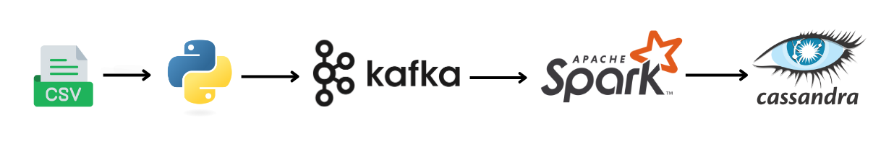

## Cricket Match Data Streaming with Kafka and Spark

Overview

This project demonstrates real-time data streaming of ball-by-ball cricket match updates using Apache Kafka and Apache Spark Structured Streaming. The producer script reads cricket match data from a Pandas DataFrame and streams it to a Kafka topic at 1-minute intervals. A Spark Streaming consumer then ingests this data and writes it to Apache Cassandra for further analysis.

### Architecture

**Producer (Pandas to Kafka)**

> Reads a ball-by-ball cricket dataset using Pandas.

> Sends each row as a Kafka message at a 1-minute interval.

**Kafka Broker**

> Acts as the messaging system for real-time event streaming.

**Consumer (Spark Streaming to Cassandra)**

> Reads messages from Kafka in real-time.

> Parses the JSON data and transforms it into a structured format.

>Writes the structured data into Cassandra.

### Expected Output

> Kafka receives ball-by-ball updates.

> Spark reads the Kafka stream and writes to Cassandra.

> Cassandra stores the data for further analysis.